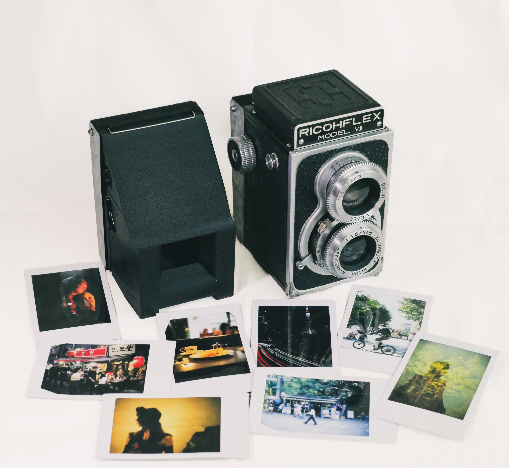

# RICOHFLEX instax back

# RICOHFLEX instax back

RICOHFLEXで**instax mini**フィルムを使用できるようにするための改造キットです。

このリポジトリでは、キットを製作するために必要な3Dデータ、図面、部品表、マニュアルを公開しています。

本プロジェクトは3Dプリント部品を中心に構成されていますが、一部の重要部品には金属加工が必要です。そのため、ある程度の工作設備や加工経験を持つ方向けの内容となっています。

---

## 対応機種

ヘリコイド式のピント調整機構を持つRICOHFLEXに対応しています。

* RICOHFLEX III
* RICOHFLEX VI
* RICOHFLEX VII
など

RICOHFLEX Dia には対応していません。

---

## リポジトリ構成

### `data`

製作に必要なデータをまとめています。

* **bom** - 部品表
* **parts** - STL、STEP、部品図
* **assembly** – 組立に必要なSTEPファイルと組立に関する注意事項
* **extras** - レンズフードなどのおまけデータ

### `manual`

取扱説明書があります。

---

## はじめに

製作を始める前に、以下の手順で進めることをおすすめします。

1. 部品表（BOM）を確認する
2. STL・STEP・図面を確認し、必要な部品を製作する
3. 組立の注意事項とSTEPファイルを参照しながら組み立てる
4. 取扱説明書を確認して使用する

---

## フィードバック

不具合報告、改善案などはウェルカムです。

改良版や派生版を作ったらたら見せてね。

---

## ライセンス

個人での利用、改造、改良は大歓迎です。

本プロジェクトおよび本プロジェクトのデータを利用した製品の商用利用・販売は禁止とします。

詳しくは **LICENSE** をご確認ください。

---

## 開発について

このプロジェクトの開発経緯や設計に関する記事は、ブログで公開しています。同人誌にもまとめました。

開発記録や設計意図に興味のある方は、ぜひそちらもご覧ください。

---

## 連絡先

製作中に困ったことや不具合、対応機種の情報、改善案などがありましたら、お気軽にご連絡ください。

すべてのお問い合わせに対応できるとは限りませんが、お答えできる範囲でできるだけお手伝いします。

また、完成したカメラや撮影した写真、改良版や派生作品なども、ぜひ見せていただけると嬉しいです。

- Blog: https://hocke.hatenablog.com/archive/category/RICOHFLEX%20instax%20back
- X (Twitter): https://x.com/hocke_mk
- Instagram: https://www.instagram.com/hocke__/
